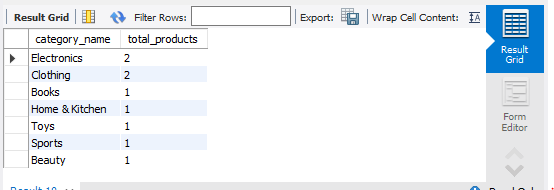
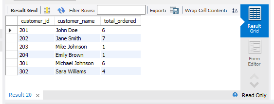

-- Tạo cơ sở dữ liệu
CREATE DATABASE StoreDatabase;

-- Sử dụng cơ sở dữ liệu vừa tạo
USE StoreDatabase;

-- Tạo bảng Categories
CREATE TABLE Categories (
category_id INT PRIMARY KEY,
category_name VARCHAR(255)
);

-- Tạo bảng Products
CREATE TABLE Products (
product_id INT PRIMARY KEY,
product_name VARCHAR(255),
category_id INT,
price DECIMAL(10, 2),
quantity INT,
FOREIGN KEY (category_id) REFERENCES Categories(category_id)
);

-- Tạo bảng Customers
CREATE TABLE Customers (
customer_id INT PRIMARY KEY,
customer_name VARCHAR(255),
email VARCHAR(255)
);

-- Tạo bảng Orders
CREATE TABLE Orders (
order_id INT PRIMARY KEY,
customer_id INT,
order_date DATE,
FOREIGN KEY (customer_id) REFERENCES Customers(customer_id)
);

-- Tạo bảng OrderDetails
CREATE TABLE OrderDetails (
order_detail_id INT PRIMARY KEY,
order_id INT,
product_id INT,
quantity INT,
FOREIGN KEY (order_id) REFERENCES Orders(order_id),
FOREIGN KEY (product_id) REFERENCES Products(product_id)
);

-- Chèn dữ liệu vào bảng Categories
INSERT INTO Categories (category_id, category_name)
VALUES
(1, 'Electronics'),
(2, 'Clothing'),
(3, 'Books'),
(4, 'Home & Kitchen'),
(5, 'Toys'),
(6, 'Sports'),
(7, 'Beauty');

-- Chèn dữ liệu vào bảng Products
INSERT INTO Products (product_id, product_name, category_id, price, quantity)
VALUES
(101, 'Smartphone', 1, 500, 100),
(102, 'Laptop', 1, 1000, 50),
(103, 'T-shirt', 2, 20, 200),
(104, 'Jeans', 2, 40, 150),
(105, 'Fiction Book', 3, 10, 300),
(106, 'Cookware Set', 4, 60, 80),
(201, 'RC Car', 5, 50, 30),
(202, 'Basketball', 6, 25, 40),
(203, 'Shampoo', 7, 8, 100);

-- Chèn dữ liệu vào bảng Customers
INSERT INTO Customers (customer_id, customer_name, email)
VALUES
(201, 'John Doe', 'john@example.com'),
(202, 'Jane Smith', 'jane@example.com'),
(203, 'Mike Johnson', 'mike@example.com'),
(204, 'Emily Brown', 'emily@example.com'),
(301, 'Michael Johnson', 'michael@example.com'),
(302, 'Sara Williams', 'sara@example.com');

-- Chèn dữ liệu vào bảng Orders
INSERT INTO Orders (order_id, customer_id, order_date)
VALUES
(301, 201, '2023-08-01'),
(302, 201, '2023-08-03'),
(303, 202, '2023-08-04'),
(304, 203, '2023-08-05'),
(305, 204, '2023-08-05'),
(401, 301, '2023-08-06'),
(402, 302, '2023-08-07');

-- Chèn dữ liệu vào bảng OrderDetails
INSERT INTO OrderDetails (order_detail_id, order_id, product_id, quantity)
VALUES
(401, 301, 101, 2),
(402, 301, 103, 3),
(403, 302, 102, 1),
(404, 303, 103, 5),
(405, 303, 105, 2),
(406, 304, 101, 1),
(407, 305, 106, 1),
(501, 401, 201, 2),
(502, 401, 202, 1),
(503, 401, 203, 3),
(504, 402, 203, 4);

-- 1. Lấy thông tin tất cả các sản phẩm đã được đặt trong một đơn đặt hàng cụ thể.
SELECT
p.product_id,
p.product_name,
od.quantity,
(p.price * od.quantity) AS total_cost
FROM
OrderDetails od
JOIN
Products p ON od.product_id = p.product_id
WHERE
od.order_id = 401;

-- 2. Tính tổng số tiền trong một đơn đặt hàng cụ thể.
SELECT
o.order_id,
SUM(p.price * od.quantity) AS total_order_cost
FROM
Orders o
JOIN
OrderDetails od ON o.order_id = od.order_id
JOIN
Products p ON od.product_id = p.product_id
WHERE
o.order_id = 401
GROUP BY
o.order_id;

-- 3. Lấy danh sách các sản phẩm chưa có trong bất kỳ đơn đặt hàng nào.
SELECT
p.product_id,
p.product_name
FROM
Products p
LEFT JOIN
OrderDetails od ON p.product_id = od.product_id
WHERE
od.product_id IS NULL;

-- 4. Đếm số lượng sản phẩm trong mỗi danh mục. (category_name, total_products)
SELECT
c.category_name,
COUNT(p.product_id) AS total_products
FROM
Categories c
LEFT JOIN
Products p ON c.category_id = p.category_id
GROUP BY
c.category_name;

-- 5. Tính tổng số lượng sản phẩm đã đặt bởi mỗi khách hàng (customer_name, total_ordered)
SELECT
c.customer_id,
c.customer_name,
SUM(od.quantity) AS total_ordered
FROM
Customers c
JOIN
Orders o ON c.customer_id = o.customer_id
JOIN
OrderDetails od ON o.order_id = od.order_id
GROUP BY
c.customer_id, c.customer_name;

-- 6. Lấy thông tin danh mục có nhiều sản phẩm nhất (category_name, product_count)
WITH CategoryCounts AS (
SELECT
c.category_name,
COUNT(p.product_id) AS product_count
FROM
Categories c
JOIN
Products p ON c.category_id = p.category_id
GROUP BY
c.category_name
)
SELECT
category_name,
product_count
FROM
CategoryCounts
WHERE
product_count = (SELECT MAX(product_count) FROM CategoryCounts);

-- 7. Tính tổng số sản phẩm đã được đặt cho mỗi danh mục (category_name, total_ordered)
SELECT
c.category_name,
SUM(od.quantity) AS total_ordered
FROM
Categories c
JOIN
Products p ON c.category_id = p.category_id
JOIN
OrderDetails od ON p.product_id = od.product_id
GROUP BY
c.category_name;

-- 8. Lấy thông tin về top 3 khách hàng có số lượng sản phẩm đặt hàng lớn nhất (customer_id, customer_name, total_ordered)
SELECT
c.customer_id,
c.customer_name,
SUM(od.quantity) AS total_ordered
FROM
Customers c
JOIN
Orders o ON c.customer_id = o.customer_id
JOIN
OrderDetails od ON o.order_id = od.order_id
GROUP BY
c.customer_id, c.customer_name
ORDER BY
total_ordered DESC
LIMIT 3;

-- 9. Lấy thông tin về khách hàng đã đặt hàng nhiều hơn một lần trong khoảng thời gian cụ thể từ ngày A -> ngày B (customer_id, customer_name, total_orders)
SELECT
c.customer_id,
c.customer_name,
COUNT(o.order_id) AS total_orders
FROM
Customers c
JOIN
Orders o ON c.customer_id = o.customer_id
WHERE
o.order_date BETWEEN '2023-08-01' AND '2023-08-07'
GROUP BY
c.customer_id, c.customer_name
HAVING
total_orders > 1;

-- 10. Lấy thông tin về các sản phẩm đã được đặt hàng nhiều lần nhất và số lượng đơn đặt hàng tương ứng (product_id, product_name, total_ordered)
WITH ProductOrderCounts AS (
SELECT
p.product_id,
p.product_name,
COUNT(od.order_id) AS total_orders
FROM
OrderDetails od
JOIN
Products p ON od.product_id = p.product_id
GROUP BY
p.product_id, p.product_name
)
SELECT
product_id,
product_name,
total_orders
FROM
ProductOrderCounts
WHERE
total_orders = (
SELECT MAX(total_orders)
FROM ProductOrderCounts
);
